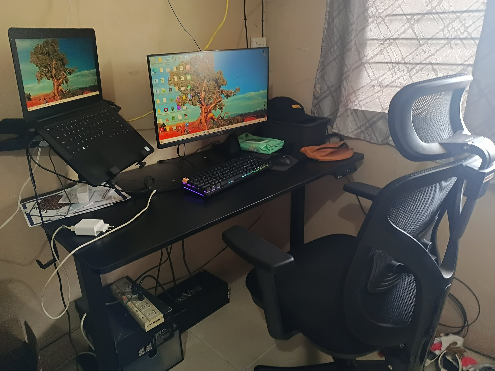

# Research & Learn

## What are the risks of using a laptop without an external monitor or keyboard?

The risks of not using external monitor or keyboard may include poor neck posture, poor wrist posture, shoulder strain, back pain and many others. This can cause physical issues in the future if not corrected as early as possible.

## What ergonomic equipment can improve posture when working on a laptop? (e.g., laptop stands, external keyboards, ergonomic chairs)

There are many ergonomic equipment that can help improve posture when working on a laptop like risers, external keyboard and mouse, ergonomic chair, external monitor, footrest, and others. Investing on a good ergonomic chair can help a person's back, shoulder, and neck posture significantly. The equipment mentioned can help a person be more productive and help their physical health in the long run.

## What adjustments should be made to monitor height, chair position, and desk setup for a healthier workspace?

For monitor height, the top of the monitor must be aligned at or slightly below eye level and an arm's length away to avoid eye strain. The chair position must be adjusted wherein the feet are flat on the floor with the knees and hips at 90-degree angles. The desk height must allow elbow to rest at 90 degrees and keeping wrists neutral.

## What are some daily habits that reduce the impact of prolonged laptop use? (e.g., movement breaks, posture checks, eye strain reduction techniques)

For eye strain, always take a break for at least 20 seconds to look at something that is relaxing to eye muscles. It could be done every after 20 minutes. Moreover, adjust screen brightness that matches room lighting. Once in a while, do movement breaks to do stretching, stand or walking around. Desk stretches can also be helpful in reducing muscle tension. Always have a water beside and drink as often to keep the body hydrated. Maintain an active awareness of your posture throughout the day.

# Reflection

## What equipment changes can you make to improve your workspace setup? (e.g., using an external monitor, adjusting your chair, using a laptop stand)

I have to upgrade my seat/chair because it is not designed for work. I have adjust it according to 90-Degree rule. Moreover, I also have to optimize lumbar support.

## What behavioural changes can you implement to improve posture and reduce strain? (e.g., sitting upright, taking regular breaks, adjusting screen height)

I am not used to do movement breaks especially when I am really focused to my work. I think I have to improve that part because I do feel numbness especially when sitting for a long time.

## How can you remind yourself to maintain good posture and take breaks throughout the day? (Hint: Use Focus Bear to schedule movement breaks!)

I can remind myself doing pomodoro even though it is for study purposes. I have done it before but I did not do it as part of my routine. I can also use Focus bear to schedule movement breaks.

# Task

For my seat, I have setup my ergonomic chair because I knew I would be working for eight hours. I invested on a good chair. I aligned my chair height, desk setup, and monitor height, accordingly. As much as possible, I avoid straining my eyes, wrist, and back.

