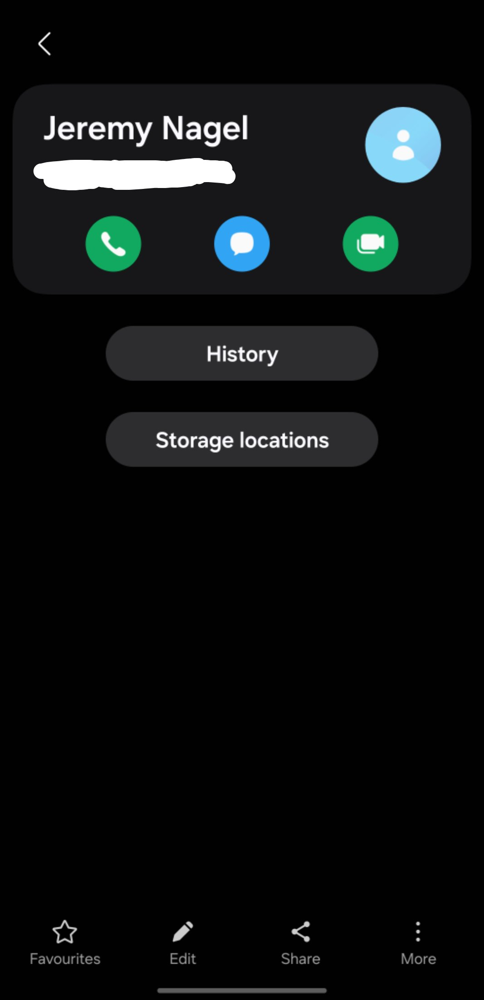

# Research & Learn

## What are examples of professional vs. unprofessional behaviour in a casual work environment? (Hint: Think about communication, meeting etiquette, and teamwork.)

| Aspect | Professional Behaviour | Unprofessional Behaviour |
|----------|----------|----------|
| Communication    | Friendly tone, but clear in instant messages     | Aggressive or  passive-aggressive language   |
| | Responds to colleagues within a reasonable time     | Purposely ignoring urgent messages     |
| | Avoiding talking inappropriate topics or outside work     | Gossiping, mocking, spreading rumors     |
| Meeting Etiquette    | Arriving in on time or earlier     | Constant tardiness   |
|  | Being engaging and come in prepared to discuss topics/agenda     | Be distracted by gadgets, interrupting others, eating food while meeting   |
| Teamwork and Collaboration   | Sharing credit for team successes     | Taking credit of somebody else's work  |
|  | Offering help to overwhelmed colleagues     | Does not help at all because it is "not their job"  |

## What does respectful communication look like in remote teams? (e.g., tone in messages, handling disagreements, responding to feedback)

When talking or messaging, always be respectful, be direct, assume positive intent, and provide necessary details as much as possible to avoid confusion. In handling disagreements, it is better to clear it up via voice call or video call to avoid misinterpretation of tone. Be obective and do not attack the person. Instead, focus on the problem. Listen to understand and not defend or prove yourself that you are right all the time. In responding to feedback, acknowledge it, ask for clarification, and focus on the need. Lastly, respect boundaries.

## How can you give and receive feedback professionally? (e.g., focus on actions, not people; assume good intent; ask for clarification instead of reacting defensively)

In giving feedback professionally, focus on the action rather than the person. Be objective. Provide solution or a guide to help the person to move forward. In receiving feedback professionally, assume good intent and do not let the emotions get the best of you. Ask for clarifications if there are any confusion or further explanation. Digest the content well before responding. There is no need to rush especially when it is understanding complex things.

# Reflection

## Have you ever experienced or witnessed great teamwork and professionalism? What made it effective?

Yes, I was fortunate enough to be in that team. What made it effective because everyone exerted the same effort, same enthusiasm, open-mindedness, actively provide suggestions and listens to other suggestions. Everyone was focused and had their attention on reaching the goal. If there were any misunderstanding, everyone communicated and focused on the problem rather than the person.

## What steps can you take to make sure your communication is clear, respectful, and inclusive?

I prioritize clarity and directness. I also practice inclusive communication so that everyone can understand what I am talking about. People have different time to process information so it is important to deliver it in simple manner. Most importantly, main respectful tone.

## How can you help create a positive, fun, and professional work environment?

First of all, it is to do my best to be a reliable teammate. Always meet the milestones and communicate progress. Celebrate small wins and give compliments to encourage people even more. A simple courtesy like "Good morning", "Thank you. I appreciate it.", etc. can encourage people to do good. It promotes healthy work environment. Be respectful of other's working styles. Always take feedback as a tip for growth. Always be objective and solution-oriented.

## How can you prepare effectively for meetings with supervisors and colleagues?

It is important to have agenda so everyone will know what is to be discussed. Set a goal so that there will be a definitive goal. List all discussion points. Do research first. Always organize your workspace environment to avoid delays or technical malfunctions.

## What would it look like to be proactive during your internship?

Before asking for help, I always try to solve it by myself using the resources available to me. I document every attempt/solution done and its respective outcomes. Always report my progress. I also do practice drafting PRs so the other teammates will be able to see progress or early issues/mistake. I also try to manage my own time.

## How might you follow up with colleagues or supervisors if you need information/action from them? How would you escalate it further if you don't get a response and when would you escalate?

I provide the topic and the necessary details to guide colleagues or supervisors what the message is all about. I also do provide alternatives if it they are not available at that time. I think it would be best to message first in Discord before doing SMS or direct messages. If it is really an emergency, I would try to notify them in SMS first then wait for response. I would ask permission if we can call. Basically, I construct a structured message containing all necessary details and questions and deadline.

## What are some things you won't do?

1. Not taking any initiative
2. Be unprepared in meetings
3. Not taking notes.
4. Not doing research beforehand
5. Not taking feedback seriously
6. Not escalating communication when necessary
7. Not giving details/agenda before meeting

## Task

I have saved CEO's phone number.

