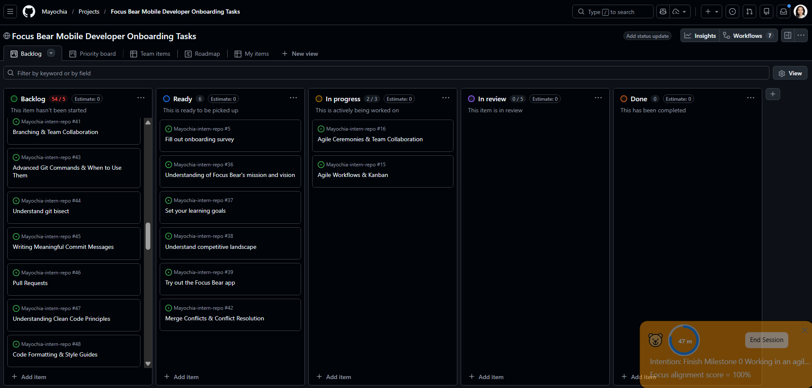

# Research & Learn

## How does a Kanban board work, and how does it help manage workflow?

It is a visual tool that shows various stages of process like Backlog, To Do, In Progress, Testing/QA, and Done. Since it is visualized, everyone in the team can see the tasks worked on and who is responsible for it. There is limited Work in Progress (WIP) of how many tasks can be in at once. It has a continuous flow and allows developers to work in their own pace.

## What do the different columns on a Kanban board represent? (e.g., Backlog, In Progress, Blocked, Done)

1. Backlog - user stories, new features, technical debt, and bugs that have not been scheduled yet
2. To Do - prioritized features, bugs, or user stories that needs to be addressed 
3. In Progress - a developer has the capacity to start or has already begun doing the task.
4. Blocked - a task that is blocked/stalled due to external dependency
5. Testing/QA - coding is complete and is now tested for quality and security
6. Done - fully meets the "Definition of Done" and are ready for release

## How do tasks move through the board, and who is responsible for updating them?

The team members are the ones who pulls moves tasks through the board. For updating, the project manager owns the priority in the "To Do" list and QA moves the verified task to "Done".

## What are the benefits of limiting work in progress (WIP)?

It avoids mental drain of jumping between frontend and backend tasks. It helps developers to focus and make fewer errors. Additionaly, it helps QA to spot what process slows down the progress. It ensures features are delivered frequently. It also encourages teamwork. In case a teammate finishes a "Blocked" or "Testing" and cannot start new work, they can help others. 

# Reflection

## How does Kanban help manage priorities and avoid overload?

Kanban offers visuals, so it prevents cognitive overload while ensuring that important work gets done first. Most valuable task are prioritized. Prevents flooding in progress works and helps developers to focus. 

## How can you improve your workflow using Kanban principles?

Establishing personal WIP limit can help me to focus deeper on the task one at a time. For personal checklist of "Done", I must have my own developer testing and clear PR notes. If I do not have new task to do, I can help with fixing existing bugs.

# Task

With the help of Kanban, this will help me track all of my tasks without overwhelming me. I am updating the Kanban as a habit.